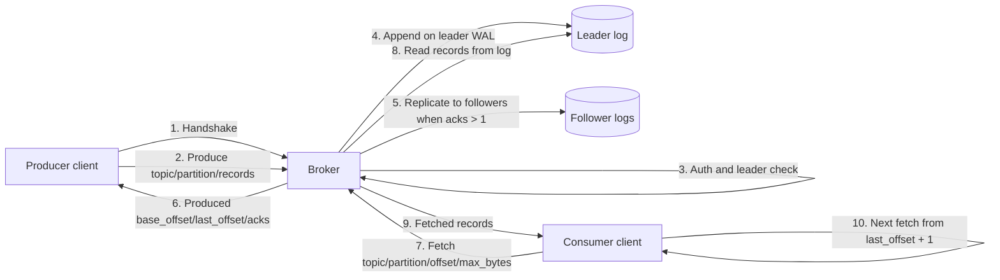

# Logos

Logos is a compact, append-only log broker built for write-heavy workloads. It provides a minimal TCP protocol, segmented storage with recovery, sparse indices, leader/follower roles with acked replication, and hardened defaults for TLS and auth.

## What this is
- Length-delimited TCP protocol with `bincode` payloads for compact frames and strict frame/batch limits.
- Append-only segmented WAL with rotation, crash-safe recovery, sparse index, and offline compaction with tombstones.
- Leader/follower roles with leader-epoch fencing, ack quorum, retries, backoff, and bounded batch sizes for replication.
- Dynamic metadata reload (JSON file) so leaders/followers can change without restart.
- TLS for inbound and outbound replication; token-based authZ/authN with topic isolation and optional quotas.
- Admin/metrics HTTP on `RK_ADMIN_ADDR`: Prometheus `/metrics`, `/admin/compact`, `/admin/retention`.

## Layout
- [src/main.rs](src/main.rs): boot, TCP server, framing, shutdown handling.
- [src/config.rs](src/config.rs): env-driven config (network, storage, limits, TLS/auth).
- [src/protocol.rs](src/protocol.rs): request/response types and codec helpers.
- [src/broker.rs](src/broker.rs): request router wired to storage.
- [src/storage/mod.rs](src/storage/mod.rs): append-only log with rotation, recovery, index, retention, compaction.
- [src/replication.rs](src/replication.rs): leader-to-follower replication with ack wait and timeouts.
- [src/metadata.rs](src/metadata.rs): static metadata loader for leaders/followers and peer addresses.

## Quick start (dev only)
```
RK_REQUIRE_AUTH=false RK_REQUIRE_TLS=false cargo run --release
```
This disables auth/TLS so you can replay the fixture frames in `tests/fixtures/v1`. Do not use this mode in production.

## Production checklist
- TLS: set `RK_TLS_CERT`/`RK_TLS_KEY` and `RK_TLS_CA` (and `RK_TLS_CLIENT_CA` if you require mTLS). Set `RK_REQUIRE_TLS=true` to fail fast without certs.
- AuthZ/AuthN: provide `RK_AUTH_PATH` and leave `RK_REQUIRE_AUTH=true` (default). Set `RK_REPLICATION_TOKEN` mapped to a principal with `allow_replicate=true`. Set `RK_ADMIN_TOKEN` for admin/metrics (required when `RK_ADMIN_ADDR` is non-loopback). Restrict admin network (Helm NetworkPolicy or your own).
- Persistence: enable Helm `.Values.productionProfile.enabled=true` (or `persistence.enabled=true`) and configure `persistence.storageClass/size`.
- Limits and safety: tune `RK_MAX_FRAME_BYTES`, `RK_MAX_BATCH_BYTES`, `RK_MAX_CONNECTIONS`, replication timeouts/retries, and `RK_FSYNC` (leave true for durability).
- Metadata: in multi-node setups, supply a metadata JSON via `RK_METADATA_PATH` so leaders/followers and epochs fence stale writers.
- Observability: scrape Prometheus metrics on `RK_ADMIN_ADDR`; watch TLS/auth failures, replication lag, and disk usage.

## Configuration (env, defaults in parens)
| Parameter | Default | Description |
| --- | --- | --- |
| `RK_BIND_ADDR` | `0.0.0.0:9092` | TCP listen address for the broker protocol. |
| `RK_ADMIN_ADDR` | `127.0.0.1:9100` | HTTP listen address for `/healthz`, `/metrics`, and admin endpoints. |
| `RK_DATA_DIR` | `./data` | Root directory for segment files and partition data. |
| `RK_SEGMENT_BYTES` | `134217728` | Maximum size of an active segment before rotation. |
| `RK_MAX_CONNECTIONS` | `1024` | Maximum concurrent accepted client connections. |
| `RK_RETENTION_BYTES` | `unset` | Retention cap for total sealed segment bytes per partition. |
| `RK_RETENTION_SEGMENTS` | `unset` | Retention cap for number of sealed segments per partition. |
| `RK_INDEX_STRIDE` | `16` | Sparse index sampling interval (every N records). |
| `RK_NODE_ID` | `node-1` | Local node identifier used by metadata/replication. |
| `RK_METADATA_PATH` | `unset` | Path to metadata JSON; when unset, broker runs in single-node mode. |
| `RK_METADATA_REFRESH_MS` | `1000` | Metadata reload interval in milliseconds. |
| `RK_REPLICATION_ACKS` | `1` | Required acknowledgements for produce (`1` = leader only). |
| `RK_REPLICATION_TIMEOUT_MS` | `1000` | Timeout for each replication attempt in milliseconds. |
| `RK_REPLICATION_RETRIES` | `2` | Number of replication retries per follower. |
| `RK_REPLICATION_BACKOFF_MS` | `200` | Delay between replication retries in milliseconds. |
| `RK_CONSUMER_GROUP_HEARTBEAT_MS` | `3000` | Expected heartbeat interval for consumer group members. |
| `RK_CONSUMER_GROUP_SESSION_TIMEOUT_MS` | `15000` | Member eviction timeout for consumer groups before rebalance. |
| `RK_REPLICATION_TOKEN` | `unset` | Token used for inter-node replication auth. |
| `RK_FSYNC` | `true` | Whether writes are fsynced for stronger durability. |
| `RK_MAX_FRAME_BYTES` | `4194304` | Maximum incoming protocol frame size. |
| `RK_MAX_BATCH_BYTES` | `4194304` | Maximum payload bytes allowed in produce/replicate batch. |
| `RK_AUTH_PATH` | `unset` | Path to auth principals/tokens JSON file. |
| `RK_REQUIRE_AUTH` | `true` | Fail startup when auth is not configured. |
| `RK_TLS_CERT` | `unset` | Path to server certificate PEM for inbound TLS. |
| `RK_TLS_KEY` | `unset` | Path to server private key PEM for inbound TLS. |
| `RK_TLS_CLIENT_CA` | `unset` | Optional client CA bundle for mTLS verification. |
| `RK_TLS_CA` | `unset` | CA bundle used for outbound TLS verification. |
| `RK_TLS_DOMAIN` | `unset` | TLS SNI/server name for outbound replication TLS. |
| `RK_ADMIN_TOKEN` | `unset` | Bearer token for admin/metrics access; when unset, admin endpoints return unauthorized. |
| `RK_REQUIRE_TLS` | `false` | Fail startup when TLS endpoints are not fully configured. |

Helm: set `.Values.productionProfile.enabled=true` to turn on persistence, TLS, and auth defaults; wire secrets for cert/key/CA, auth file, replication token, and admin token (`.Values.adminTokenSecret` or `.Values.env.adminToken`). By default, admin service port is not exposed and NetworkPolicy is enabled.

## Protocol (MVP)
Frames are length-delimited (u32 big-endian) and contain `bincode`-encoded structs. `PROTOCOL_VERSION = 1`. Clients start with `Handshake { client_version }`; server replies `HandshakeOk { server_version }`.

Requests:
- `Handshake { client_version: u16 }`
- `Produce { topic, partition, records, auth? }`
- `Fetch { topic, partition, offset, max_bytes, auth? }`
- `Replicate { leader_id, leader_epoch, topic, partition, entries, auth? }`
- `JoinGroup { group_id, topic, member_id?, auth? }`
- `Heartbeat { group_id, topic, member_id, generation, auth? }`
- `CommitOffset { group_id, topic, member_id, generation, partition, offset, auth? }`
- `GroupFetch { group_id, topic, member_id, generation, partition, offset, max_bytes, auth? }`
- `LeaveGroup { group_id, topic, member_id, generation, auth? }`
- `Health`

`Produce.records` and `Replicate.entries` must be non-empty; the broker rejects empty batches.

Responses:
- `HandshakeOk { server_version: u16 }`
- `Produced { base_offset, last_offset, acks }`
- `Fetched { records: Vec<FetchedRecord> }`
- `NotLeader { leader: Option<String> }`
- `Error(String)`
- `GroupJoined { group_id, member_id, generation, heartbeat_interval_ms, session_timeout_ms, assignments }`
- `HeartbeatOk { group_id, member_id, generation }`
- `OffsetCommitted { group_id, member_id, generation, topic, partition, offset }`
- `RebalanceRequired { group_id, generation }`
- `GroupLeft { group_id, member_id, generation }`

## Produce and consume flow


Producer/consumer request loop:
- Producer sends `Produce`; broker validates auth, checks leadership, appends locally, optionally replicates, then returns `Produced`.
- Consumer sends `Fetch` with current offset; broker returns `Fetched { records }` from that offset onward.
- After compaction, offsets can be sparse; if the requested offset was removed, `Fetch` returns the next visible record at or above that offset.
- Consumer updates its next offset to `last_seen_offset + 1` and repeats fetch.
- On `NotLeader`, reconnect to the suggested leader and retry produce/fetch on that node.

## Consumer groups
- Consumer groups are pull-based. Members still fetch explicitly, but the broker now assigns topic partitions to a single member at a time and rejects `GroupFetch`/`CommitOffset` for non-owners.
- Group lifecycle: `JoinGroup` returns `member_id`, `generation`, heartbeat/session timers, and assigned `{ topic, partition, offset }` tuples. Consumers should fetch from those offsets, commit `last_processed_offset + 1`, keep sending `Heartbeat`, and call `LeaveGroup` during graceful shutdown.
- Coordinator selection is cluster-wide: every broker hashes `group_id` over the known node IDs and forwards `JoinGroup`, `Heartbeat`, `CommitOffset`, and `LeaveGroup` to the same coordinator node. That gives the cluster one shared in-memory coordinator state per group without requiring all partitions to live on one leader.
- `GroupFetch` can be sent to any broker that hosts the partition data. If that broker is not the group coordinator, it validates ownership remotely against the coordinator before serving records.
- If heartbeats stop for longer than `RK_CONSUMER_GROUP_SESSION_TIMEOUT_MS`, the broker evicts that member and rebalances the partitions among the remaining members.
- On `RebalanceRequired { generation }`, the client must rejoin the group and use the new generation before fetching or committing again.
- Current limitation: coordinator state is shared logically through the selected coordinator node, but it is still in-memory only. If that node restarts, members must rejoin and any unflushed committed offsets are lost.
- In single-node mode, if a topic has not been created yet, the coordinator assumes partition `0` for initial assignment so a worker can join before the first produce.

## Client semantics
- Producers: with `acks >= 2` the write is confirmed after the leader and at least one follower persist it; ordering is per-partition; no idempotence (retries can duplicate).
- Fetch: returns bytes on the node you hit; commit watermark is for recovery, not filtering. After compaction, clients can observe sparse offsets and should advance from the last returned offset rather than assuming contiguity. Clients must follow leaders (on `NotLeader`) and de-duplicate during leader changes.
- Consumer groups: ownership is enforced per partition and generation. Exactly-once delivery is still not provided; consumers should keep handlers idempotent because restarts and rebalances can replay records after the last committed offset.
- Redirects/retries: on `NotLeader` reconnect to the suggested leader; on `Error("fenced")` refresh metadata/epochs.
- Security: when auth is enabled, all requests must include a token in `auth`; quotas cap bytes over 1s windows.

## Compatibility and tests
- Golden frames live in `tests/fixtures/v1/*.bin`; [tests/protocol_compat.rs](tests/protocol_compat.rs) keeps wire format stable.
- Add new enum variants at the end; add fields with `#[serde(default)]`; bump `PROTOCOL_VERSION` on breaking changes and refresh fixtures via `cargo run --quiet --example gen_fixtures`.

## Metadata file (static example)
```json
{
    "self_id": "node-a",
    "nodes": {"node-a": "127.0.0.1:9092", "node-b": "127.0.0.1:9093"},
    "topics": {
        "test": {
            "0": {"leader": "node-a", "followers": ["node-b"], "epoch": 3}
        }
    }
}
```
`RK_METADATA_REFRESH_MS` controls reload cadence so epoch changes fence stale leaders and replication requests.

## AuthZ/AuthN and quotas
`RK_AUTH_PATH` points to JSON like:
```json
{
    "token-1": {
        "name": "analytics-writer",
        "topics": ["events", "metrics"],
        "allow_produce": true,
        "allow_fetch": false,
        "allow_replicate": false,
        "quota_bytes_per_sec": 1048576
    },
    "token-2": {
        "name": "reader",
        "topics": ["*"],
        "allow_produce": false,
        "allow_fetch": true,
        "allow_replicate": false
    }
}
```
Tokens must be supplied in `auth` when auth is enabled. With `RK_REQUIRE_AUTH=true` (default), startup fails unless the auth file exists and `RK_REPLICATION_TOKEN` is set. The replication token should map to a principal with `allow_replicate=true` to isolate inter-node traffic from client creds.

## Retention and compaction
- Tombstone = `Record` with empty `value`; compaction drops keys whose newest record is a tombstone and rewrites segments.
- Compaction is offline per partition; run `Storage::compact` (or `compact_async`) when quiet to avoid losing in-flight appends.

## SLOs and alerts (guidance)
- Frontdoor success ≥ 99.9% for produce/fetch (excluding client timeouts beyond `RK_REPLICATION_TIMEOUT_MS` + network).
- p99 latency: produce ≤ 250ms at `acks=1`, ≤ 500ms at `acks=2`; replication lag p99 ≤ 200ms.
- Durability: fsync lag ≤ one segment; commit should trail writes by <1s.
- Capacity: keep ≥ 15% free space; sealed segments within retention.
- Security: TLS/auth failures ≤ 0.1% when enforcement is on.
- Prometheus hints: `fsync_lag_bytes`, `replication_lag_ms`, `under_replicated_partitions`, `disk_usage_percent`, `tls_handshake_failures_total`, `authz_denied_total`, `broker_request_errors_total`.

## Runbooks (cheat sheet)
- Fsync lag/errors: pause producers or reduce quotas, check I/O (iostat), segment rotation, keep `RK_FSYNC=true`; restart only after disk stabilizes.
- Replication lag/under-replicated: check network/TLS/SNI, replication token, epochs; restart followers first; fence stale leaders via metadata.
- Disk fullness: enable retention or lower `RK_RETENTION_*`, run `/admin/retention`, move partitions, pause producers; avoid compaction on full disks until space is freed.
- TLS/auth spikes: verify cert validity and CA chains, `RK_TLS_DOMAIN`, and tokens; refresh auth file if rotated.
- Produce/fetch errors: on `NotLeader` update metadata; on `acks not satisfied` fix replicas or lower acks; on `fenced` ensure epochs are current and only one leader exists.

## SDK
See [src/sdk.rs](src/sdk.rs) for an async client that performs handshake, produce, fetch, `JoinGroup`, `Heartbeat`, `CommitOffset`, `LeaveGroup`, and `GroupFetch` with optional auth tokens. The SDK also exposes `spawn_group_heartbeats` for a background heartbeat loop on a dedicated connection. For TLS, configure the connector with your CA and SNI domain.

## Next steps
- Depends on requrements... and testing

## License
Source-available: free for evaluation and non-commercial use. Commercial use requires a paid license; contact the maintainers to obtain terms.
